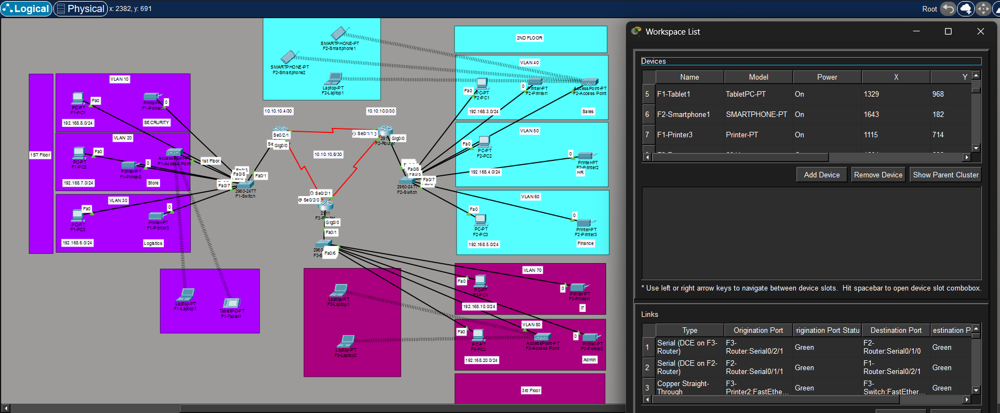

# 🌐 Enterprise Network Architecture (3-Floor Design)


---

## 🚀 Project Overview

A **real-world enterprise network simulation** built using **CCNA fundamentals** and designed with a **CCNP-level architecture mindset**.

This project represents a **3-floor corporate network**, focusing on scalability, segmentation, routing efficiency, and wireless communication.

---

## 🏢 Architecture Highlights

* 🧱 Hierarchical Network Design (Core / Distribution / Access)
* 🏢 Multi-floor enterprise deployment
* 🔀 VLAN-based segmentation
* 🌐 Inter-VLAN communication
* 📶 Wireless infrastructure integration
* 🔗 WAN connectivity between routers

---

## 🔀 VLAN Segmentation

| VLAN | Department | Network        |
| ---- | ---------- | -------------- |
| 10   | Security   | 192.168.0.0/24 |
| 20   | Store      | 192.168.7.0/24 |
| 30   | Logistics  | 192.168.6.0/24 |
| 40   | Sales      | 192.168.3.0/24 |
| 50   | HR         | 192.168.4.0/24 |
| 60   | Finance    | 192.168.5.0/24 |
| 70   | IT         | 192.168.1.0/24 |
| 80   | Admin      | 192.168.2.0/24 |

---

## 📶 Network Topology



---

## 🌐 Features Implemented

* 🔁 Inter-VLAN Routing
* 🔀 VLAN Trunking (802.1Q)
* 🌍 Static Routing
* ⚡ OSPF (Dynamic Routing)
* 📡 DHCP Configuration
* 📶 Wireless Access Points
* 🔗 WAN Simulation

---

## 🔧 Technologies Used

| Category  | Technology            |
| --------- | --------------------- |
| Simulator | Cisco Packet Tracer   |
| Routing   | OSPF                  |
| Switching | VLAN, 802.1Q Trunking |
| Services  | DHCP, ARP, ICMP       |

---

## ⚙️ Configuration Samples

### 🔹 VLAN Configuration (Switch)

```bash
enable
configure terminal
vlan 10
name SECURITY
exit

interface fastEthernet0/1
switchport mode access
switchport access vlan 10
```

---

### 🔹 Trunk Configuration

```bash
interface gigabitEthernet0/1
switchport mode trunk
switchport trunk encapsulation dot1q
```

---

### 🔹 OSPF Configuration (Router)

```bash
router ospf 1
network 192.168.0.0 0.0.255.255 area 0
```

---

### 🔹 DHCP Configuration

```bash
ip dhcp pool VLAN10
network 192.168.0.0 255.255.255.0
default-router 192.168.0.1
```

---

## 💡 Learning Outcomes

* 📈 Designed scalable enterprise networks
* 🔧 Implemented real-world routing & switching
* 🧠 Strengthened subnetting & IP planning
* 🛠️ Improved troubleshooting skills

---

## 🚀 Future Enhancements

* 🔐 Access Control Lists (ACL)
* 🌍 NAT Configuration
* 🛡️ Network Security Policies
* 🌐 Multi-area OSPF

---

## 👨‍💻 Author

MOHAMMED NADHEER

---

## ⭐ Project Highlights

> Built with a **CCNP mindset**, this project demonstrates the ability to design, configure, and optimize enterprise-grade networks using real-world technologies.

---

## 📌 Tags

#CCNP #Networking #EnterpriseNetwork #OSPF #VLAN #Cisco #PacketTracer
